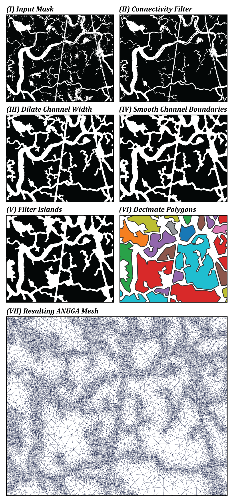

# Unstructured Mesh Refinement Method

Set of Python image processing tools to embed remotely-sensed channel networks into an [ANUGA](https://github.com/GeoscienceAustralia/anuga_core) hydrodynamic model mesh to improve computational efficiency. 

More information to come. For more details in the meantime, please see our preprint on EarthArXiv:

[Wright, K., Passalacqua, P., Simard, M., Jones, C.E. (2022) Integrating Connectivity Into Hydrodynamic Models: An Automated Open-Source Method to Refine an Unstructured Mesh Using Remote Sensing, *EarthArXiv preprint*, doi:10.31223/X57K9V](https://doi.org/10.31223/X57K9V)

## Example Application

The image below shows an example application of this workflow to a small region of coastal wetlands near the Wax Lake & Atchafalaya Deltas. We used a remote-sensing derived binary image (emphasizing hydrodynamic features of interest) to embed information about the landscape structure into the mesh of an ANUGA model. Image from Wright et al., (2022).

## Requirements

The mesh refinement codes have been tested in Python 3.7+ and require a functional installation of the following packages:
- numpy
- matplotlib
- scipy
- pandas
- [rasterio](https://rasterio.readthedocs.io/en/latest/installation.html)
- [scikit-image](https://scikit-image.org/docs/dev/install.html)
- [rdp](https://pypi.org/project/rdp/)

A functional installation of [ANUGA](https://github.com/anuga-community/anuga_core/blob/master/INSTALL.rst) is not required to run these codes, but obviously would be necessary to make use of the outputs.

## Funding Acknowledgement

This work was supported by the [NASA Delta-X project](https://deltax.jpl.nasa.gov/), which is funded by the Science Mission Directorate's Earth Science Division through the Earth Venture Suborbital-3 Program NNH17ZDA001N-EVS3.
